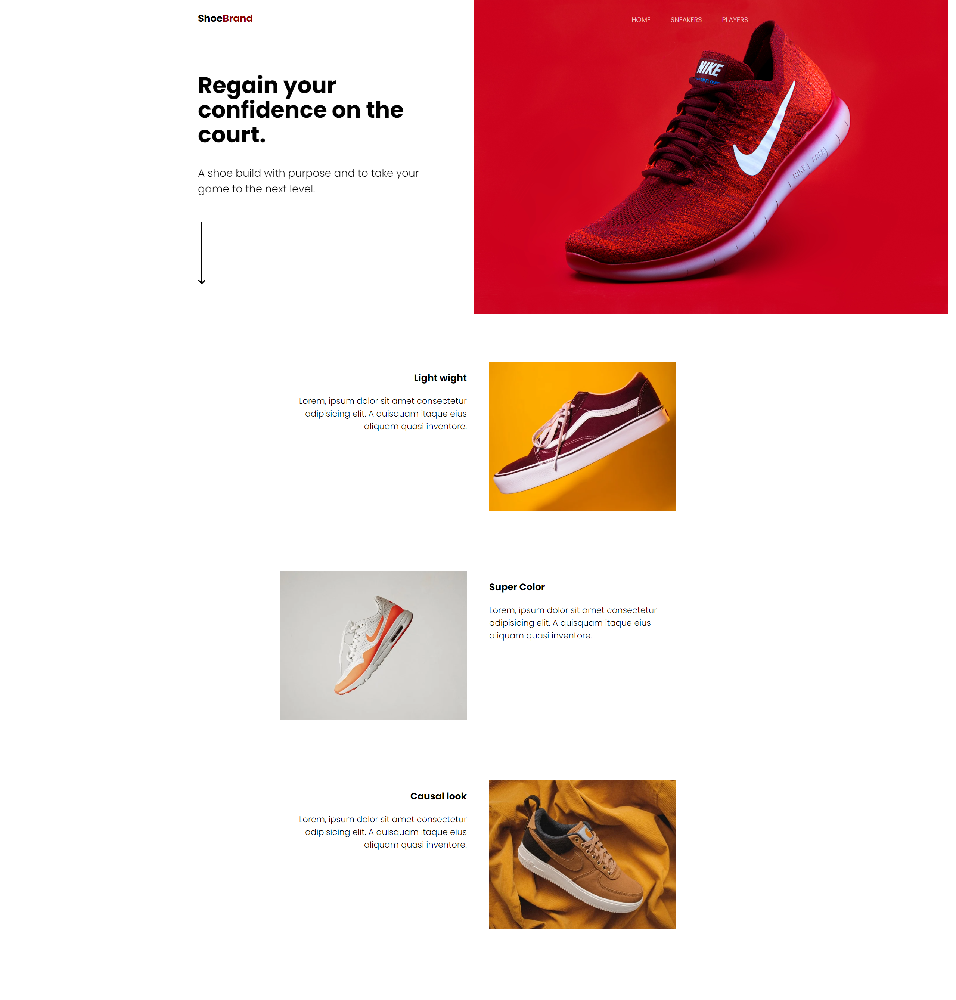
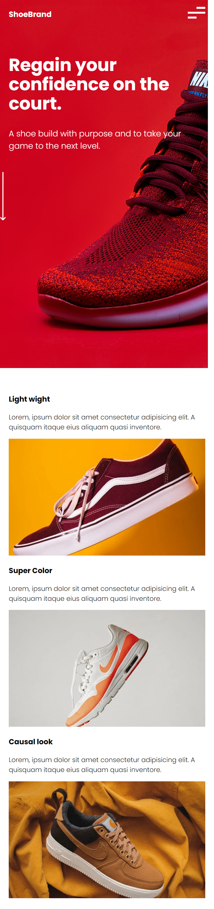
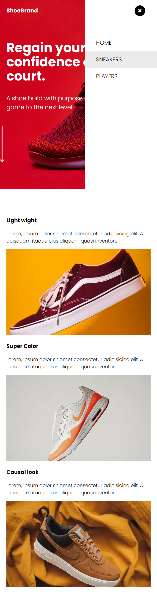

# UDEMY--ShoeBrand-2022 👟
Small responsive website excersice from Udemy course (HTML, CSS, JS) about product of ShoeBrand company: 👟

<h3>This is how the site looks like: </h3>
⬇️⬇️⬇️

<h3>This is how the site looks like on mobile: </h3>
⬇️⬇️⬇️

